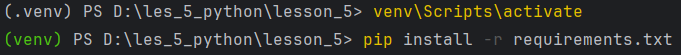

Для развёртывания проекта необходимо:
1) Убедиться, что на компьютере установлен Python. Проверить это можно с помощью команды: python --version. Если не установлен, нужно скачать с сайта https://www.python.org/downloads/
2) Склонировать репозиторий git@github.com:nastyachalovskaia/lesson_5.git в предварительно созданную директорию на компьютере
3) Создать виртуальное окружение командой python -m venv venv
4) Активировать окружение командой для Windows venv\Scripts\activate
5)  
после активации окружения появляется имя окружения (см.картинку)
6) Установить зависимости командой: pip install -r requirements.txt
7) Чтобы запустить проект, необходимо воспользоваться командой python -m pytest test/test_order.py
8) В конце деактивируйте виртуальное окружение командой deactivate 